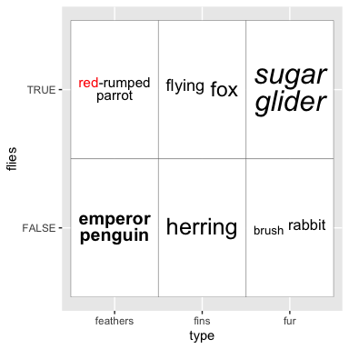
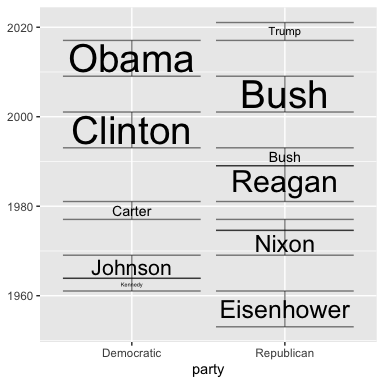
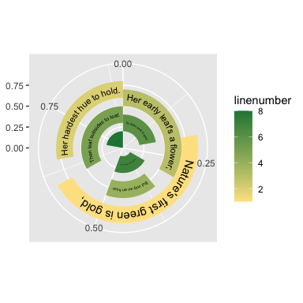

<!-- badges: start -->

[](https://github.com/wilkox/gggenes/actions)
[](https://cran.r-project.org/package=ggfittext)
[](https://lifecycle.r-lib.org/articles/stages.html#experimental)
<!-- badges: end -->

# ggfittext

ggfittext is a ggplot2 extension for fitting text into boxes.

<!-- -->

## Installation

Install the release version of ggfittext from CRAN:

``` r
install.packages("ggfittext")
```

If you want the development version, install it from GitHub:

``` r
devtools::install_github("wilkox/ggfittext")
```

## Fitting text inside a box

Sometimes you want to draw some text in a ggplot2 plot so that it fits
inside a defined area. You can do this by manually fiddling with the
font size, but this is tedious and un-reproducible. ggfittext provides a
geom called `geom_fit_text()` that automatically resizes text to fit
inside a box. It works like this:

``` r
ggplot(animals, aes(x = type, y = flies, label = animal)) +
  geom_tile(fill = "white", colour = "black") +
  geom_fit_text()
```

<!-- -->

As with `geom_text()`, the position of the text is set by the `x` and
`y` aesthetics. `geom_fit_text()` tries to infer the width and height of
the box in which the text is allowed to fit, and shrinks down any text
that is too big.

## Reflowing text

Another way to make the text fit in the box is by reflowing it; that is,
wrapping it over multiple lines. With the `reflow = TRUE` argument,
`geom_fit_text()` will reflow the text before (if still necessary)
shrinking it:

``` r
ggplot(animals, aes(x = type, y = flies, label = animal)) +
  geom_tile(fill = "white", colour = "black") +
  geom_fit_text(reflow = TRUE)
```

<!-- -->

## Growing text

If you want the text to be as large as possible, the argument
`grow = TRUE` will increase the text size to the maximum that will fit
in the box. This works well in conjunction with `reflow`:

``` r
ggplot(animals, aes(x = type, y = flies, label = animal)) +
  geom_tile(fill = "white", colour = "black") +
  geom_fit_text(reflow = TRUE, grow = TRUE)
```

<!-- -->

## Placing text

By default, text is placed in the centre of the box. However, you can
place it in a corner or on a side of the box with the `place` argument,
which takes values like “top”, “topright”, “bottomleft” and so on:

``` r
ggplot(animals, aes(x = type, y = flies, label = animal)) +
  geom_tile(fill = "white", colour = "black") +
  geom_fit_text(place = "topleft", reflow = TRUE)
```

<!-- -->

## Bar plots

ggfittext also provides a geom `geom_bar_text()` for labelling bars in
bar plots:

``` r
ggplot(altitudes, aes(x = craft, y = altitude, label = altitude)) +
  geom_col() +
  geom_bar_text()
```

<!-- -->

`geom_bar_text()` works with stacked bar plots:

``` r
ggplot(beverages, aes(x = beverage, y = proportion, label = ingredient,
                    fill = ingredient)) +
  geom_col(position = "stack") +
  geom_bar_text(position = "stack", reflow = TRUE)
```

<!-- -->

And it works with dodged bar plots, and with flipped bar plots:

``` r
ggplot(beverages, aes(x = beverage, y = proportion, label = ingredient,
                    fill = ingredient)) +
  geom_col(position = "dodge") +
  geom_bar_text(position = "dodge", grow = TRUE, reflow = TRUE, 
                place = "left") +
  coord_flip()
```

<!-- -->

### Experimental feature: rich text

With the `rich = TRUE` argument, `geom_fit_text()` and `geom_bar_text()`
both support a limited subset of Markdown and HTML markup for text
(rendered with [gridtext](https://wilkelab.org/gridtext/)).

``` r
ggplot(animals_rich, aes(x = type, y = flies, label = animal)) +
  geom_tile(fill = "white", colour = "black") +
  geom_fit_text(reflow = TRUE, grow = TRUE, rich = TRUE)
```

<!-- -->

Rich text cannot be drawn in polar coordinates. Please note that this
feature is liable to change, and is subject to upstream changes to
gridtext.

## Specifying the box limits

If you want to manually set the limits of the box (instead of having
them inferred from `x` and `y`), you can use `xmin` & `xmax` and/or
`ymin` & `ymax`:

``` r
ggplot(presidential, aes(ymin = start, ymax = end, x = party, label = name)) +
  geom_fit_text(grow = TRUE) +
  geom_errorbar(alpha = 0.5)
```

<!-- -->

Alternatively, you can set the width and/or height with the `width`
and/or `height` arguments, which should be `grid::unit()` objects. The
horizontal and/or vertical centre of the box will be defined by `x`
and/or `y`.

## Experimental feature: text in polar coordinates

Text can be drawn in polar coordinates with `geom_fit_text()` simply by
adding `coord_polar()` to the plot. This feature is experimental and any
bug reports are very welcome.

``` r
p <- ggplot(gold, aes(xmin = xmin, xmax = xmax, ymin = ymin, ymax = ymax, 
                 fill = linenumber, label = line)) +
  coord_polar() +
  geom_rect() +
  scale_fill_gradient(low = "#fee391", high = "#238443")

p + geom_fit_text(min.size = 0, grow = TRUE)
```

<!-- -->

When text is drawn in polar coordinates, the `flip = TRUE` argument can
be used to flip upside-down text the ‘right way up’ to ease readability:

``` r
p + geom_fit_text(min.size = 0, grow = TRUE, flip = TRUE)
```

<!-- -->

## Other useful arguments

All arguments to `geom_fit_text()` can also be used with
`geom_bar_text()`.

- **`contrast`** can be used to automatically invert the colour of the
  text so it contrasts against a background `fill`:

``` r
ggplot(animals, aes(x = type, y = flies, fill = mass, label = animal)) +
  geom_tile() +
  geom_fit_text(reflow = TRUE, grow = TRUE, contrast = TRUE)
```

<!-- -->

- **`padding.x`** and **`padding.y`** can be used to set the padding
  between the text and the edge of the box. By default this is 1 mm.
  These values must be given as `grid::unit()` objects.
- **`min.size`** sets the minimum font size in points, by default 4
  pt. Text smaller than this will be hidden (see also `outside`).
- **`outside`** is `FALSE` by default for `geom_fit_text()`. If `TRUE`,
  text that is placed at “top”, “bottom”, “left” or “right” and must be
  shrunk smaller than `min.size` to fit in the box will be flipped to
  the outside of the box (if it fits there). This is mostly useful for
  drawing text inside bars in a bar plot.
- **`hjust`** and **`vjust`** set the horizontal and vertical
  justification of the text, scaled between 0 (left/bottom) and 1
  (right/top). These are both 0.5 by default.
- **`formatter`** allows you to provide a function that will be applied
  to the text before it is drawn. This is mostly useful in contexts
  where variables may be interpolated, such as when using
  [gganimate](https://gganimate.com/).
- **`fullheight`** is automatically set depending on place, but can be
  overridden with this option. This is used to determine the bounding
  box around the text. If `FALSE`, the bounding box includes the
  x-height of the text and ascenders, but not any descenders. If TRUE,
  it extends from the top of the ascenders to the bottom of the
  descenders. This is mostly useful in situations where you want to
  ensure the baseline of text is consistent between labels
  (`fullheight = FALSE`), or when you want to avoid descenders spilling
  out of the bounding box (`fullheight = TRUE`).

<!-- -->

<!-- -->
